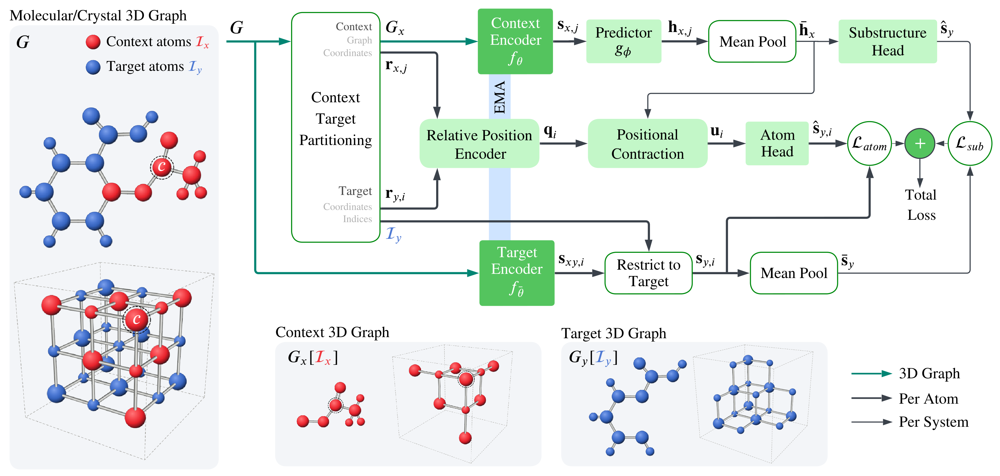

# Atom-JEPA: Joint-Embedding Predictive Architecture for 3D Atomistic Systems

<p align="center">
  <a href="todo"></a>
  <a href="todo"></a>
  <a href="https://huggingface.co/atom-jepa/atom-jepa"></a>
  <a href="https://pypi.org/project/atom-jepa/"></a>
</p>

Official implementation of **Atom-JEPA: Joint-Embedding Predictive Architecture for 3D Atomistic Systems**.

Atom-JEPA is a self-supervised pretraining method for 3D atomistic systems.
It learns by predicting the latent representations of one part of a structure
from another. The same recipe applies to both molecules and crystals.

There are two ways to use Atom-JEPA:

- **The `atom-jepa` Python package** ([PyPI](https://pypi.org/project/atom-jepa/)): `pip install`
  it to load the [pretrained encoders](https://huggingface.co/atom-jepa/atom-jepa), embed molecules
  and crystals, and fine-tune the encoder in your own code. See [Python package](#python-package).
- **This repository**: clone it to pretrain encoders, which only the repository supports, and to
  run the benchmark fine-tuning from the paper. See [Using this repository](#using-this-repository).



<sub>Each structure is split into complementary context (red) and target (blue) subgraphs
by sampling a k-hop neighborhood around an anchor atom. The context encoder embeds the
context, and a predictor uses it to predict the target representations at two scales:
individual atoms and mean-pooled substructures. Targets come from the full structure,
encoded by an exponential-moving-average copy of the context encoder. The two subgraphs
alternate as context and target. After pretraining, the context encoder is fine-tuned
for downstream property prediction.</sub>

## Contents

- [Pretrained models](#pretrained-models)
- [Python package](#python-package)
- [Using this repository](#using-this-repository): installation, layout, pretraining, fine-tuning, notebook
- [License](#license)
- [Citation](#citation)

## Pretrained models

The pretrained encoders are on Hugging Face at [atom-jepa/atom-jepa](https://huggingface.co/atom-jepa/atom-jepa):

| name | domain | pretraining data |
|---|---|---|
| `molecules` | molecules | Uni-Mol, 19M molecules |
| `crystals` | inorganic crystals | Alexandria PBE 3D, 1.7M crystals |

Both the package and the repository's scripts load them by name and download the weights
on first use. The encoder is EquiformerV3, based on
[atomicarchitects/equiformer_v3](https://github.com/atomicarchitects/equiformer_v3).

## Python package

[`atom-jepa`](https://pypi.org/project/atom-jepa/) is for using the pretrained encoders:
embedding molecules and crystals, and fine-tuning the encoder with your own head and
training loop. Pretraining and the paper's benchmark scripts are in the
[repository](#using-this-repository).

### Installation

Install [PyTorch](https://pytorch.org/get-started/locally/) first, then:

```bash
pip install atom-jepa            # structures as arrays or ase.Atoms
pip install "atom-jepa[rdkit]"   # + SMILES input
pip install "atom-jepa[all]"     # + SMILES and pymatgen input
pip install "atom-jepa[cu12]"    # + cuEquivariance GPU kernels for CUDA 12 ([cu13] for CUDA 13)
```

Extras combine, e.g. `"atom-jepa[all,cu12]"`; `python -m atom_jepa.info` shows what your
machine supports and which kernel extra matches your PyTorch.

### Embeddings

```python
from atom_jepa import AtomJEPA

model = AtomJEPA.from_pretrained("molecules")      # or "crystals", or a local checkpoint
smiles = ["CCO", "c1ccncc1"]

model.embed(smiles)                                  # [2, 256]        last layer, l=0
model.embed(smiles, layers="all")                    # [2, 8, 256]     output of each of the 8 blocks
model.embed(smiles, degrees="all")                   # [2, 9, 256]     l=0, l=1 (3), l=2 (5) components
model.embed(smiles, degrees="all", invariant=True)   # [2, 3, 256]     l=0 and per-channel norms of l=1, l=2
model.embed(smiles, per_atom=True)                   # list of [n_atoms, 256]
```

- `embed` takes SMILES strings (one RDKit ETKDGv3 + MMFF94 conformer), `ase.Atoms`,
  pymatgen structures, or `(atomic_numbers, positions[, cell])`, one at a time or as a list.
- `layers` is `"last"` (default: the last block after the final norm), block numbers 1-8,
  or `"all"`; `degrees` is 0 (default), a list of l's, or `"all"`. Structure features are
  the mean over atoms.
- The l>0 components are equivariant (l=1 rotates like an (x, y, z) vector);
  `invariant=True` makes them rotation invariant.

### Fine-tuning in your own code

`AtomJEPA` is a `torch.nn.Module`: calling it on a batch returns differentiable features
with the same options, so you can train your own head together with the encoder:

```python
import torch
from torch.utils.data import DataLoader
from atom_jepa import AtomJEPA, to_sample

model = AtomJEPA.from_pretrained("molecules").train()
head = torch.nn.Linear(model.embedding_dim, 1).to(model.device)

data = [{**to_sample(s), "y": torch.tensor([y])} for s, y in zip(train_smiles, train_y)]
loader = DataLoader(data, batch_size=32, shuffle=True, collate_fn=model.collate)
opt = torch.optim.AdamW([{"params": model.parameters(), "lr": 1e-5},
                         {"params": head.parameters(), "lr": 1e-3}])
for batch in loader:
    loss = torch.nn.functional.mse_loss(head(model(batch)), batch["y"].to(model.device))
    opt.zero_grad(); loss.backward(); opt.step()
```

`model.set_grad_checkpointing(True)` trades compute for memory on large structures.

### Execution on GPU

On a CUDA GPU the encoder runs in bf16 and, if the kernels are installed, with
cuEquivariance; otherwise it runs in plain fp32 PyTorch. The settings are printed when
loading and can be set explicitly:

```python
model = AtomJEPA.from_pretrained("molecules")                        # auto
# [atom-jepa] molecules: device=cuda, precision=bf16, cuequivariance=on, compile=off
#   we recommend compile=True for larger jobs
model = AtomJEPA.from_pretrained("molecules", compile=True)          # compile the blocks (CUDA)
model = AtomJEPA.from_pretrained("molecules", precision="fp32", cuequivariance=False)  # plain
```

bf16 changes the embeddings slightly; use `precision="fp32"` for exact fp32 features.
Compiling adds a one-off cost on the first batches.

## Using this repository

The repository has the pretraining code, which the package does not include, and the
fine-tuning, probing and baseline scripts used for the paper's benchmarks. The model code
is the same `atom_jepa` package.

### Installation

Clone the repository. You need Python 3.12, PyTorch 2.x with CUDA, and PyTorch Geometric.
Then install the remaining dependencies from [requirements.txt](requirements.txt):

```bash
git clone https://github.com/khelverskovp/atom-jepa.git && cd atom-jepa
python -m pip install -r requirements.txt
```

Run all commands from the repository root. Any config option can be overridden on the
command line with Hydra syntax, e.g. `optim.lr=1e-4`. Runs log to Weights & Biases by
default; add `wandb.enabled=false` to any command to turn this off.

**Fast fine-tuning (recommended).** By default, the fine-tuning scripts run the encoder
with bf16, compiled transformer blocks and cuEquivariance kernels for speed. These
defaults need the CUDA 13 packages:

```bash
python -m pip install -r finetuning/requirements-cue-cu13.txt
```

For CUDA 12, use the matching `cu12` wheels. To run without them, set
`cuequivariance=false` and `compile_blocks=false` in the task's config section, e.g.
`finetune.cuequivariance=false finetune.compile_blocks=false` for QM9 and ADMET, or
`matbench.cuequivariance=false matbench.compile_blocks=false` for MatBench.

### Repository layout

```
atom-jepa/
├── atom_jepa/                the atom-jepa package: model, graphs, batching, checkpoint loading
│   ├── api.py                AtomJEPA: load a pretrained encoder, embed structures, fine-tune
│   ├── execution.py, cue.py  bf16, torch.compile and cuEquivariance execution
│   ├── checkpoint.py         load released (Hugging Face) or local checkpoints
│   ├── conformers.py         SMILES -> 3D conformers (RDKit ETKDGv3 + MMFF94)
│   ├── info.py               python -m atom_jepa.info: what this machine supports
│   ├── models/               JEPA encoder and predictor, EquiformerV3 backbone and layers
│   └── data/                 graphs, masking, batching, splits (dataset-independent)
├── pretraining/
│   ├── train.py              JEPA pretraining (single- and multi-GPU)
│   ├── probe.py              frozen-encoder probes run during pretraining
│   └── metrics.py            representation metrics and VICReg regularization
├── finetuning/
│   ├── qm9/                  QM9 fine-tuning
│   ├── matbench/             MatBench fine-tuning
│   ├── admet/                ADMET fine-tuning, baselines and HPO (see finetuning/admet/README.md)
│   ├── probing/              frozen-encoder readout probe on QM9
│   ├── common.py             helpers shared by the fine-tuning scripts
│   └── requirements-cue-cu13.txt
├── data/                     dataset loaders (see data/README.md)
├── conf/                     Hydra configs
│   ├── pretrain.yaml         pretraining; conf/data/<dataset>.yaml selects the dataset
│   ├── finetune_*.yaml       one per fine-tuning benchmark
│   └── baseline.yaml, dataset/, model/, hpo/   ADMET baselines and HPO
├── scripts/data/             Alexandria download, filtering and LMDB conversion
├── notebooks/                SMILES -> Atom-JEPA embedding
├── assets/                   figures
├── pyproject.toml            package metadata; README.pypi.md is its PyPI description
└── .github/workflows/        builds, tests and publishes the package to PyPI
```

### Pretraining

```bash
python -m pretraining.train data=unimol       # Uni-Mol molecules (default; set data.lmdb_paths)
python -m pretraining.train data=alexandria   # Alexandria crystals (set data.src)
```

- **Uni-Mol:** point `data.lmdb_paths` at the molecular pretraining LMDB(s) from
  [Uni-Mol](https://github.com/deepmodeling/Uni-Mol). The default is `data/unimol/ligands/train.lmdb`.
- **Alexandria:** download and convert once, then point `data.src` at the output.
  The default is `data/alexandria_lmdb`.
  ```bash
  python -m scripts.data.download_alexandria --root data/alexandria   # -> data/alexandria/raw/<release>
  python -m scripts.data.alexandria_to_lmdb --src data/alexandria/raw/<release> --out data/alexandria_lmdb
  ```

For multi-GPU training, use `torchrun --nproc_per_node=<N> -m pretraining.train ...`.

During pretraining, the encoder is probed on QM9 for molecular runs, or on a
Materials Project property for crystal runs. Checkpoints go to `checkpoints/`:

| file | contents |
|---|---|
| `context_encoder_<run>.pt` | the pretrained encoder, used for fine-tuning |
| `context_encoder_best_<run>.pt` | the encoder with the best probe score |
| `train_state_<run>.pt` | full training state, for `misc.resume=true` |

To pretrain on another dataset, see [data/README.md](data/README.md).

### Fine-tuning

These are the benchmark recipes from the paper. Each script takes a pretrained encoder
as its checkpoint, given as either:
- a released encoder, `molecules` or `crystals`, downloaded from
  [Hugging Face](https://huggingface.co/atom-jepa/atom-jepa) and cached on first use; or
- a local checkpoint from your own pretraining run, e.g. `checkpoints/context_encoder_<run>.pt`.

**QM9** (one target per run: `mu alpha homo lumo gap r2 zpve U0 U H G Cv`):
```bash
python -m finetuning.qm9.finetune finetune.ckpt_path=molecules finetune.target=homo
```

**MatBench** (all eight structure tasks x the five official folds by default; select with `matbench.tasks` / `matbench.folds`):
```bash
python -m finetuning.matbench.finetune matbench.ckpt_path=crystals
```

**ADMET.** The TDC group downloads on first use. Download the other datasets once first:
```bash
python -m data.datasets.admet.download.biogen_adme
python -m data.datasets.admet.download.chembl_mt
python -m data.datasets.admet.download.expansionrx

python -m finetuning.admet.finetune_admet       finetune.ckpt_path=molecules   # TDC ADMET group
python -m finetuning.admet.finetune_biogen_adme finetune.ckpt_path=molecules
python -m finetuning.admet.finetune_chembl_mt   finetune.ckpt_path=molecules
python -m finetuning.admet.finetune_expansionrx finetune.ckpt_path=molecules
```
Fingerprint/descriptor baselines, HPO and result aggregation are described in
[finetuning/admet/README.md](finetuning/admet/README.md).

**Frozen-encoder probe.** This trains only a readout head on cached encoder features,
using the same QM9 split and recipe as fine-tuning:
```bash
python -m finetuning.probing.qm9_frozen_encoder_probe finetune.ckpt_path=molecules finetune.target=homo
```

To fine-tune the same architecture from a random initialization (no pretraining), add
`finetune.train_from_scratch=true` (QM9) or `matbench.train_from_scratch=true` (MatBench).

### Embeddings notebook

[`notebooks/molecule_to_jepa_embedding.ipynb`](notebooks/molecule_to_jepa_embedding.ipynb)
does the following:
1. Generates 3D conformers for a SMILES string (RDKit ETKDGv3 + MMFF94, as in the paper).
2. Encodes them with a pretrained context encoder.
3. Returns one embedding per conformer.

Set `SMILES` at the top of the notebook. `CHECKPOINT` defaults to the released `molecules`
encoder. The notebook runs from a clone of this repository or with `pip install "atom-jepa[rdkit]"`.

## License

The code is released under the [MIT License](LICENSE). The pretrained models on
[Hugging Face](https://huggingface.co/atom-jepa/atom-jepa) are released under
[CC BY 4.0](https://creativecommons.org/licenses/by/4.0/).

## Citation

_TODO_
